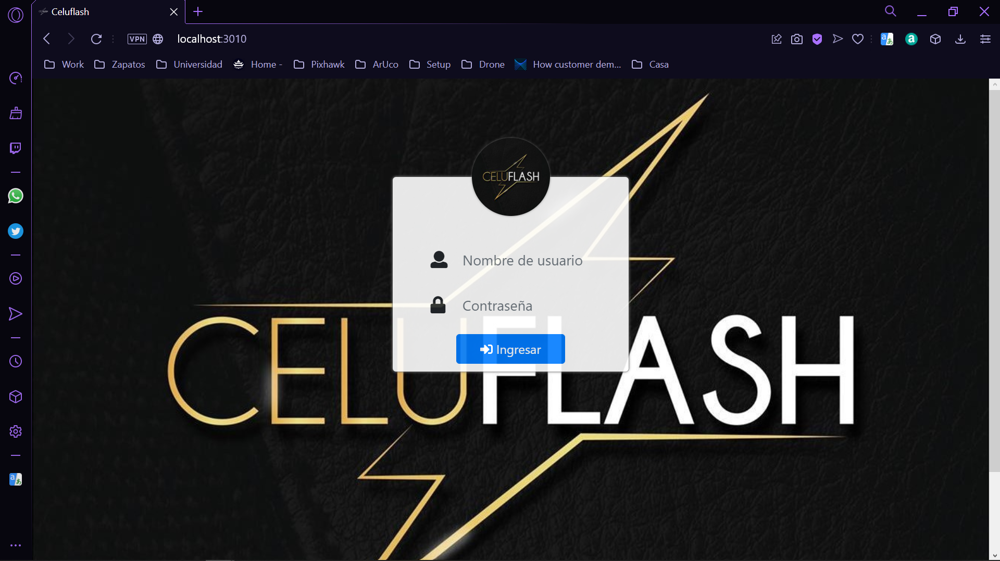
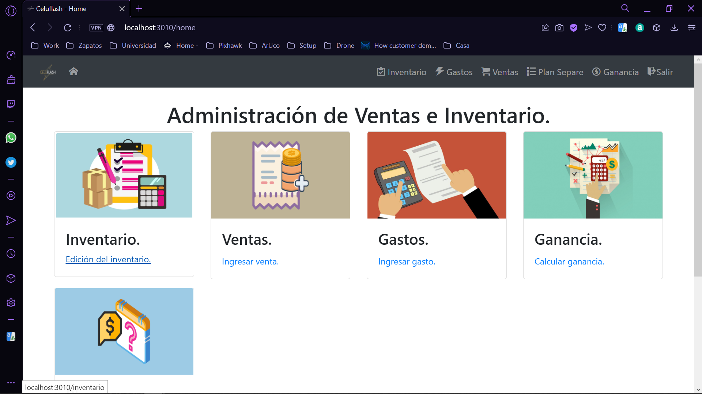
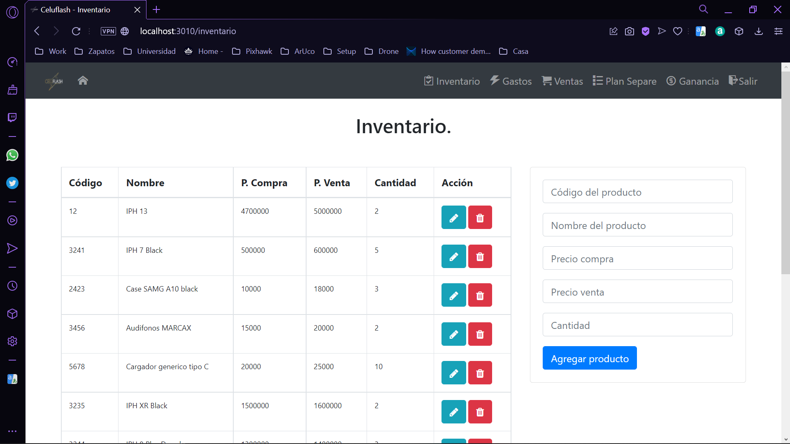

# Sistema de Inventario y Ventas 

En este proyecto de desarrolla una página web usando HTML5, EJS, CSS y ​JS que es ejecutada de manera local gracias a un servidor creado con Node.js.

##  Previsualización de la página.

### Página de login.

  

### Página home.

  

### Página de Inventario.
  

### Página de Gastos.

  

